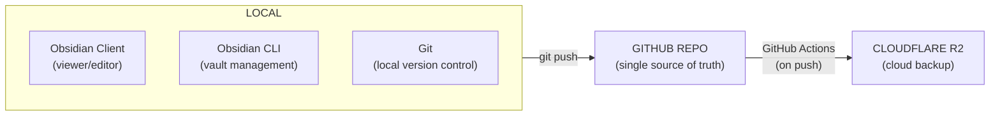
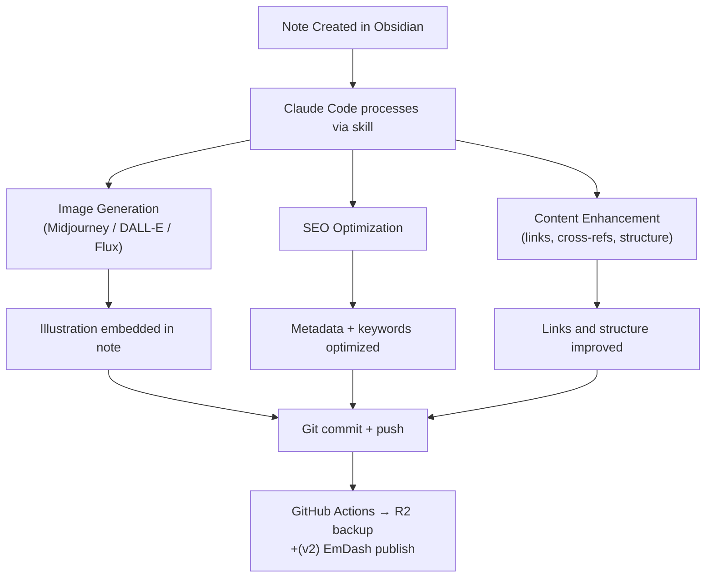
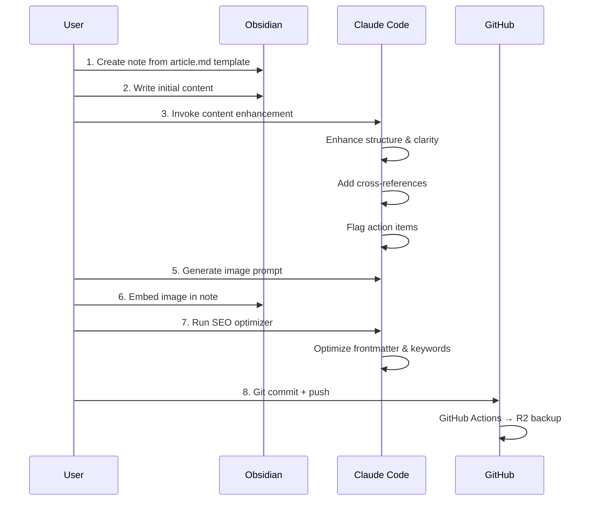
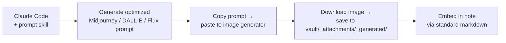
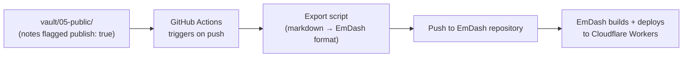

# PRD — Dream Vault: Obsidian + AI Agent Content Creation Platform

## 1. Overview

**Project Name:** Dream Vault
**Type:** Obsidian Vault Template / AI-Augmented Knowledge & Content Creation Platform
**Core Functionality:** A production-ready Obsidian vault template with GitHub as single source of truth, GitHub Actions CI/CD for automated Cloudflare R2 backup, Obsidian CLI for local vault management, and structured folder organization for content creation, illustration, SEO, and publishing.
**Target Users:** Developers, AI/ML engineers, knowledge workers, and content creators who want an AI-augmented, version-controlled, cloud-backed note-taking and content production system.

**Tech Stack Constraint:** All implementation must use **Bun + TypeScript + Biome + SQLite + Zod + LogTape + Drizzle ORM + Commander** unless a component has no viable path (e.g., GitHub Actions YAML, Obsidian plugin config). See ADR-008.

---

## 2. Goals

| Goal | Priority |
|------|----------|
| GitHub as single source of truth for vault content | P0 |
| GitHub Actions CI/CD for automated R2 cloud backup | P0 |
| Obsidian CLI + Client for local vault management | P0 |
| Structured vault folder organization | P1 |
| Image generation & illustration pipeline | P1 |
| SEO optimization tools and workflows | P1 |
| EmDash as future public publishing layer (v2) | P2 |
| Karpathy LLM wiki integration (optional) | P2 |

---

## 3. Architecture

### 3.1 Sync Flow



### 3.2 Content Creation Pipeline



---

## 4. Vault Structure

```
dream-vault/
├── vault/                             # Main Obsidian vault
│   ├── .obsidian/
│   │   ├── community-plugins.json
│   │   ├── plugins/
│   │   └── config.json
│   ├── 99_templates/                 # Note templates
│   │   ├── daily.md
│   │   ├── meeting.md
│   │   ├── project.md
│   │   ├── scratch.md
│   │   └── article.md
│   ├── 98_attachments/               # Media & files
│   │   └── _generated/               # AI-generated images
│   ├── 00-meta/
│   │   └── index.md
│   ├── 01-projects/
│   ├── 02-notes/
│   ├── 03-areas/
│   ├── 04-resources/
│   └── 05-public/                    # Notes ready for publishing
├── .github/
│   └── workflows/
│       ├── vault-r2-sync.yml          # R2 backup workflow
│       └── vault-ci.yml               # Lint, validate, publish
├── scripts/
│   └── dream-vault.sh                 # Single-entry management CLI
├── docs/
│   ├── 01_PRD.md
│   ├── 02_ARCH.md
│   └── 03_ADR.md
├── AGENTS.md                          # Agent config (symlink target)
├── CLAUDE.md -> AGENTS.md            # Symlink for Claude Code
├── GEMINI.md -> AGENTS.md            # Symlink for Gemini
├── CONFIG.md
├── README.md
└── .gitignore
```

---

## 5. Recommended Obsidian Plugins

### P0 — Critical

| Plugin | Purpose | Source |
|--------|---------|--------|
| **GitHub PR Autocomplete** | Autocomplete GitHub issues/PRs | [Community](https://community.obsidian.md/) |
| **Local REST API** | CLI-accessible API for automation | [Community](https://community.obsidian.md/) |

### P1 — Content Creation & Productivity

| Plugin | Purpose |
|--------|---------|
| **Templater** | Advanced dynamic templates |
| **QuickAdd** | Fast note creation via commands |
| **Obsidian Tasks** | Task management with checkbox syntax |
| **Vault Inspector** | Scan vault for maintenance issues |
| **Advanced URI** | Trigger Obsidian actions via CLI |
| **Metatable** | Frontmatter table view |
| **Image auto upload** | Auto-upload images to R2/S3 |
| **Panic BOT** | Bot-like commands for AI interaction |

### P2 — AI & Visual Content

| Plugin | Purpose |
|--------|---------|
| **BRAT** | Beta plugin installation from GitHub |
| **Dataview** | Query-based data views |
| **remotely-save** | In-app R2 sync (optional, for multi-device) |

---

## 6. Content Creation Workflow

### 6.1 Article/Note Creation



### 6.2 Image Generation Pipeline



**Image Generation Tools (external):**
- **Midjourney** — high-quality illustrations
- **DALL-E 3** — via OpenAI API
- **Flux.1** — open source, via Replicate
- **Adobe Firefly** — creative variations
- **Stable Diffusion** — local, self-hosted

---

## 7. SEO Optimization

### 7.1 SEO Frontmatter Fields

Every public note should include:

```yaml
---
title: "Article Title"
description: "Concise description under 160 chars"
keywords: ["tag1", "tag2", "keyword3"]
publish: true
date: 2026-05-22
author: "Your Name"
image: "./_attachments/_generated/article-cover.png"
og_type: "article"
---
```

### 7.2 SEO Workflow

```
/seo-optimizer analyze "[note-path]"
         │
         ▼
Claude Code:
  1. Checks title length (< 60 chars ideal)
  2. Verifies description (< 160 chars)
  3. Suggests keywords from content
  4. Adds related internal links
  5. Flags missing metadata
```

### 7.3 Search Engine Submission (v2)

- Google Search Console submission via GitHub Actions
- Sitemap generation from vault/_public/
- IndexNow protocol for instant Bing indexing

---

## 8. GitHub Actions CI/CD

### 8.1 Workflows

| Workflow | Trigger | Purpose |
|----------|---------|---------|
| `vault-r2-sync.yml` | push to `main`, `vault/**` | Sync vault to R2 |
| `vault-ci.yml` | push to `main` | Lint markdown, validate links |
| `vault-publish.yml` | (v2) manual trigger | Publish to EmDash |

### 8.2 `vault-r2-sync.yml`

```yaml
name: Sync Vault to R2

on:
  push:
    branches: [main]
    paths: ['vault/**']

jobs:
  sync:
    runs-on: ubuntu-latest
    steps:
      - uses: actions/checkout@v4

      - name: Configure AWS CLI
        env:
          AWS_ACCESS_KEY_ID: ${{ secrets.CLOUDFLARE_R2_ACCESS_KEY_ID }}
          AWS_SECRET_ACCESS_KEY: ${{ secrets.CLOUDFLARE_R2_SECRET_ACCESS_KEY }}
        run: |
          aws configure set aws_access_key_id $AWS_ACCESS_KEY_ID
          aws configure set aws_secret_access_key $AWS_SECRET_ACCESS_KEY
          aws configure set default.region auto

      - name: Sync vault to R2
        env:
          CLOUDFLARE_R2_ACCOUNT_ID: ${{ secrets.CLOUDFLARE_R2_ACCOUNT_ID }}
        run: |
          aws s3 sync vault/ s3://${{ secrets.CLOUDFLARE_R2_BUCKET_NAME }}/vault \
            --endpoint-url https://${CLOUDFLARE_R2_ACCOUNT_ID}.r2.cloudflarestorage.com \
            --delete
```

### 8.3 `vault-ci.yml`

```yaml
name: Vault CI

on:
  push:
    branches: [main]
    paths: ['vault/**']

jobs:
  lint:
    runs-on: ubuntu-latest
    steps:
      - uses: actions/checkout@v4
      - name: Setup Node.js
        uses: actions/setup-node@v4
        with:
          node-version: '20'

      - name: Markdown lint
        run: |
          npx markdownlint-cli2 'vault/**/*.md'
      - name: Validate attachments
        run: |
          find vault/ -name "*.md" | while read f; do
            grep -oE '!\[[^]]*\]\([^)]+\)' "$f" | sed 's/!.*](\([^)]*\)).*/\1/' | while read path; do
              case "$path" in http*) continue ;; esac
              dir=$(dirname "$f")
              abs="$dir/$path"
              if [ ! -f "$abs" ]; then
                echo "Missing attachment: $abs in $f"
                exit 1
              fi
            done
          done
```

---

## 9. Infrastructure Tooling

### 9.1 Wrangler CLI (R2 Bucket Management)

```bash
npm install -g wrangler
npx wrangler login
npx wrangler r2 bucket create dream-vault
```

### 9.2 Rclone (Optional Multi-Device Sync)

Local R2 sync tool for secondary machines. Supplementary to GitHub Actions pipeline.

```bash
brew install rclone
rclone config  # configure R2 as s3/Cloudflare remote
rclone sync ./vault r2:dream-vault/vault
```

---

## 10. EmDash Publishing (v2)

**Status:** Not in scope for v1

EmDash is the future public publishing layer. Pipeline:



---

## 11. Comparison: v1 vs Full Content Platform

| Feature | v1 (This PRD) | Full Platform (v2) |
|---------|---------------|-------------------|
| Vault sync | ✅ GitHub → R2 | ✅ |
| Image generation | ⚠️ Prompt skill only | ✅ Auto-generate + embed |
| SEO optimization | ⚠️ Skill + frontmatter | ✅ Auto sitemap + submission |
| Public publishing | ❌ | ✅ EmDash pipeline |
| Multi-user collaboration | ❌ | ✅ GitHub Teams |
| Analytics | ❌ | ✅ (future) |

---

## 12. Next Steps

- [ ] Create vault structure in `vault/`
- [ ] Configure GitHub Actions workflow for R2 sync
- [ ] Add `community-plugins.json` with P0/P1 plugins
- [ ] Add templates to `vault/99_templates/`
- [ ] Document setup in `CONFIG.md`
- [ ] Connect GitHub repo and configure secrets
- [ ] Test push → R2 sync flow
- [ ] Build image-prompt skill
- [ ] Build seo-optimizer skill
- [ ] (v2) EmDash publishing pipeline

---

## 13. Sources

- [Obsidian CLI Documentation](https://obsidian.md/cli) — Verified 2026-05-22
- [Cloudflare R2 + AWS CLI/S3](https://developers.cloudflare.com/r2/get-started/s3/) — Verified 2026-05-22
- [Cloudflare R2 + rclone](https://developers.cloudflare.com/r2/examples/rclone/) — Verified 2026-05-24
- [Wrangler CLI for R2](https://developers.cloudflare.com/r2/get-started/cli/) — Verified 2026-05-24
- [karpathy/llm.c](https://github.com/karpathy/llm.c) — Verified 2026-05-22
- [Cloudflare EmDash](https://blog.cloudflare.com/emdash-wordpress/) — Verified 2026-05-22
- [Remotely Save + R2](https://github.com/remotely-save/remotely-save/blob/master/docs/remote_services/s3_cloudflare_r2/README.md) — Verified 2026-05-24